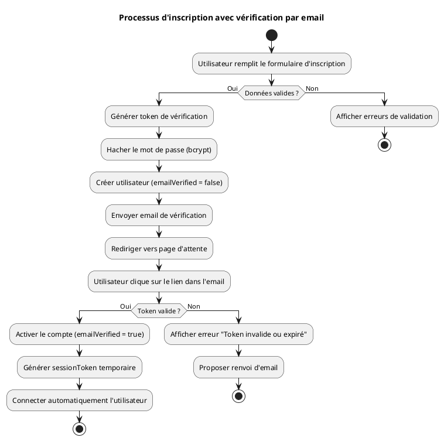
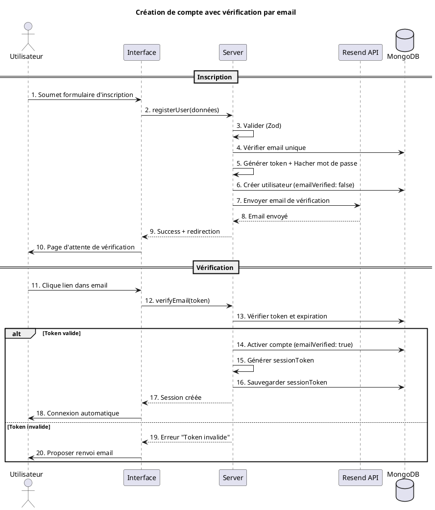

# DIAGRAMMES UML SIMPLIFIÉS - VÉRIFICATION PAR EMAIL

## 1. DIAGRAMME D'ACTIVITÉ - PROCESSUS D'INSCRIPTION (Version Simplifiée)

## 2. DIAGRAMME DE SÉQUENCE - CRÉATION DE COMPTE (Version Simplifiée)

## NOTES

Ces versions simplifiées conservent les étapes essentielles :
- ✅ Validation des données
- ✅ Génération du token
- ✅ Création du compte non vérifié
- ✅ Envoi de l'email
- ✅ Vérification du token
- ✅ Activation du compte
- ✅ Connexion automatique

Les détails techniques (bcrypt, crypto.randomBytes, etc.) peuvent être ajoutés dans la documentation textuelle si nécessaire.

