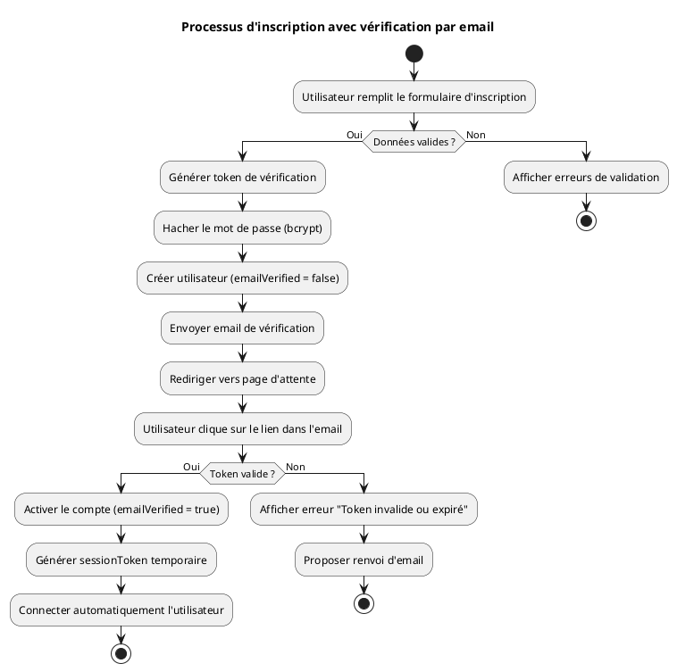
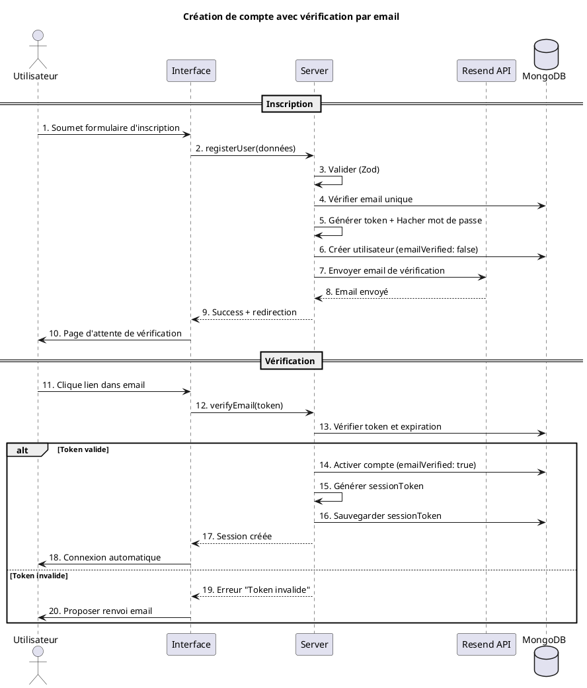
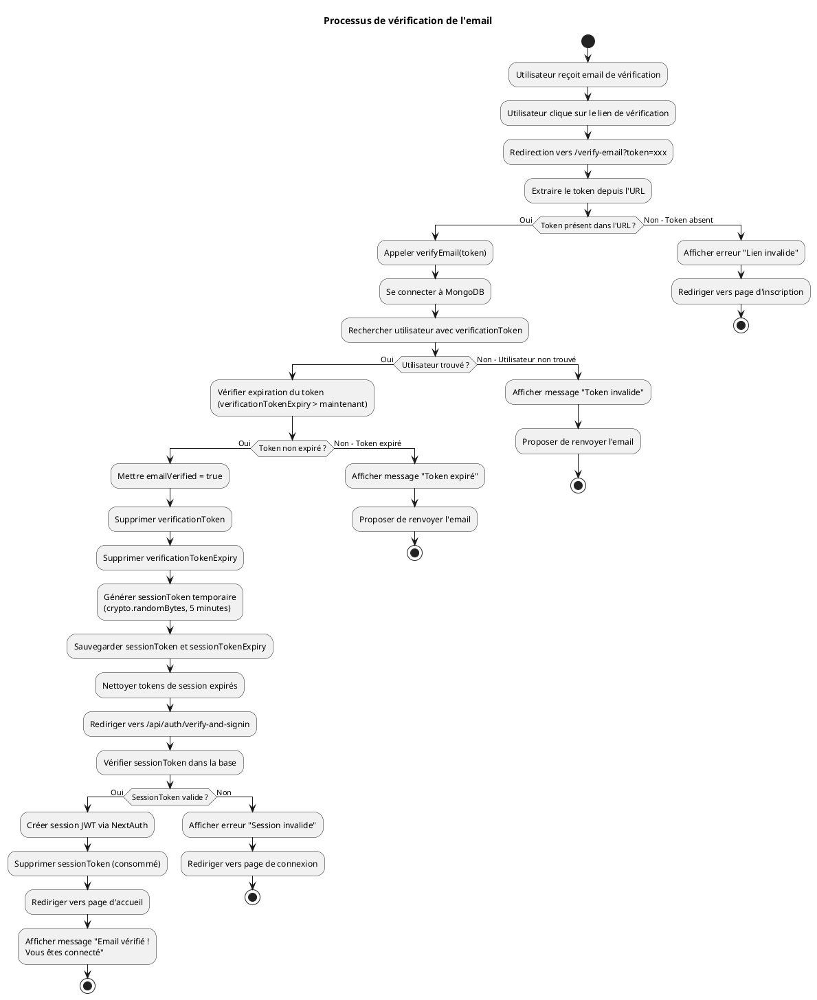

# DIAGRAMMES UML - VÉRIFICATION PAR EMAIL

## 1. DIAGRAMME D'ACTIVITÉ - PROCESSUS D'INSCRIPTION AVEC VÉRIFICATION EMAIL (Version Simplifiée)



## 2. DIAGRAMME DE SÉQUENCE - CRÉATION DE COMPTE AVEC VÉRIFICATION EMAIL (Version Simplifiée)



## 3. DIAGRAMME D'ACTIVITÉ - PROCESSUS DE VÉRIFICATION EMAIL (Détaillé)



## 4. DIAGRAMME DE SÉQUENCE - RENVOI D'EMAIL DE VÉRIFICATION

```plantuml
@startuml
title Interaction - Renvoi d'email de vérification

actor "Utilisateur" as U
participant "Page\nVérification" as Page
participant "Server Action" as Server
participant "Resend API" as Email
database "MongoDB" as DB

U -> Page : 1. Clique "Renvoyer email de vérification"

Page -> Server : 2. Appeler resendVerificationEmail(email)

Server -> DB : 3. Rechercher utilisateur par email

alt Utilisateur trouvé
    
    DB --> Server : 4. Utilisateur trouvé
    
    if (emailVerified == false ?) then (Oui)
        
        Server -> Server : 5. Générer nouveau token\n(crypto.randomBytes)
        
        Server -> Server : 6. Définir nouvelle expiration\n(24 heures)
        
        Server -> DB : 7. Mettre à jour verificationToken\net verificationTokenExpiry
        
        DB --> Server : 8. Token mis à jour
        
        Server -> Email : 9. Envoyer email de vérification\n(sendVerificationEmail)
        
        alt Email envoyé avec succès
            
            Email --> Server : 10. Email envoyé (id)
            
            Server --> Page : 11. Retourner success: true\nmessage: "Email renvoyé"
            
            Page -> U : 12. Afficher toast "Email renvoyé\navec succès"
            
        else Échec envoi email
            
            Email --> Server : 13. Erreur d'envoi
            
            Server --> Page : 14. Retourner erreur\n"Erreur lors de l'envoi"
            
            Page -> U : 15. Afficher message d'erreur
            
        end
        
    else (Non - Email déjà vérifié)
        
        Server --> Page : 16. Retourner erreur\n"Email déjà vérifié"
        
        Page -> U : 17. Afficher message\n"Votre email est déjà vérifié"
        
    endif
    
else Utilisateur non trouvé
    
    DB --> Server : 18. Aucun utilisateur trouvé
    
    Server --> Page : 19. Retourner erreur\n"Aucun compte trouvé"
    
    Page -> U : 20. Afficher message d'erreur
    
end

@enduml
```

## NOTES D'UTILISATION

Ces diagrammes peuvent être utilisés avec :
- **PlantUML** (recommandé pour génération automatique)
- **StarUML** (importation manuelle)
- **Draw.io** (création manuelle basée sur les diagrammes)

Pour utiliser avec PlantUML :
1. Copier le code dans un fichier `.puml`
2. Utiliser un éditeur PlantUML ou un plugin VS Code
3. Générer les images PNG/SVG

Pour StarUML :
1. Créer manuellement les diagrammes en suivant les interactions décrites
2. Utiliser les éléments : Actor, Participant, Database, Lifeline, Messages, Alt blocks

